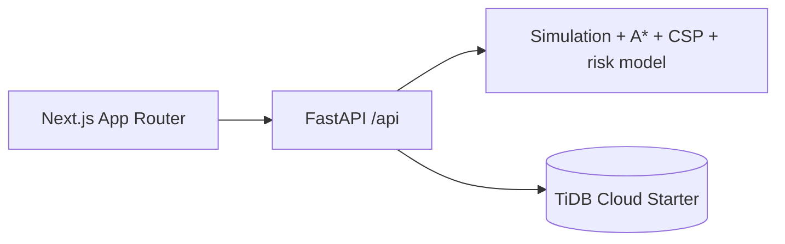

# EcosimAi-
Artificial Inteligent labratory project
# EcoSim AI

Artificial Intelligence Laboratory Project: a deterministic, educational agent-based economic society simulator. It models 500 synthetic citizens responding to food price shocks, inflation, tax changes, job shortages, and salary changes.

## Features

- Next.js research dashboard with city route visualization, agent table and live analytics
- FastAPI REST API, TiDB/MySQL-compatible SQLAlchemy schema and idempotent setup/seed scripts
- Actual A* grid routing, bounded MRV/backtracking CSP job allocation, and Logistic Regression financial-risk probability
- Synthetic seed-42 population and adjustable calibration; no official-data claims

## Architecture



## Local setup

```bash
npm install
python -m venv .venv
pip install -r requirements.txt
copy .env.example .env
python scripts/init_db.py
python scripts/seed_db.py
npm run dev
pytest
```

Configure `DATABASE_URL` for TiDB persistence. Without it, the API demo still provides a deterministic in-memory simulation for development; production persistence requires TiDB. See `docs/` for architecture, AI, dataset, and deployment details.

## Limitations

This is an understandable educational simulation, not a real economic policy forecasting system. The default population and calibration are synthetic.
